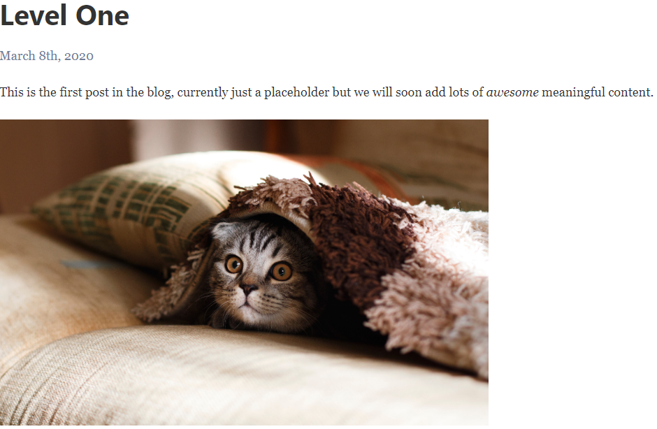
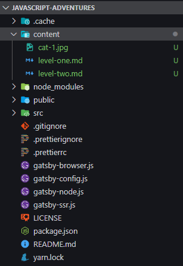
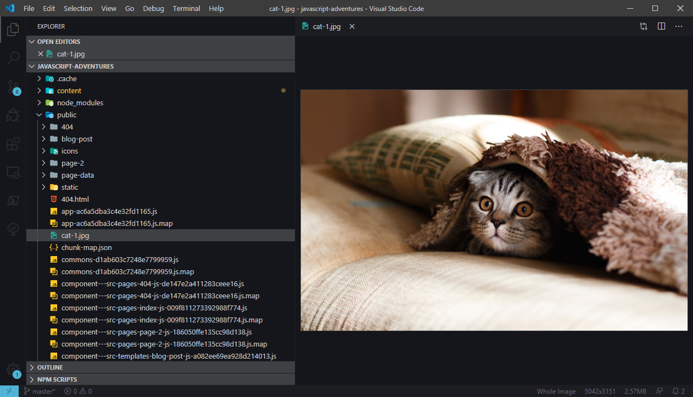
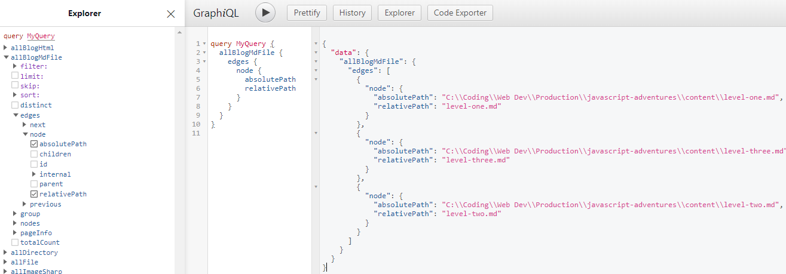

If you want to get started with Gatsby quickly, Gatsby has excellent [documentation](https://www.gatsbyjs.org/docs/). Have a look at their quick start, pick a nice starter template, create your app with the starter template, and you're off to the races!

However, I've never been the one that likes to take such complexity for granted. To be sure, there is a reason for the complexity Gatsby introduces, but you truly need to understand it in order to appreciate what it brings to the table.

Gatsby has a lot of moving pieces, particularly when you start adding plugins, and it's easy to get overwhelmed as you inevitably start customizing to suite your sites and preferences. Plugins are an extremely useful tool in Gatsby, and the community that has developed around it is [quite rich](https://www.gatsbyjs.org/plugins/). However, the best way to understand Gatsby is starting completely bare, with no plugins or starters, even those developed by the Gatsby team. Eventually, those tools will add much convenience and velocity to your development. But if you want to understand everything that's going on, its nice to start from scratch and work your way up.

Clearly there are far too many plugins to break each one down and understand them all in one shot before you even start using Gatsby, and that would be counter to the purpose of Gatsby. But there are a few core features of Gatsby which, if you can dig into them deeply and understand them at the lowest level, you will have a solid foundation upon which to draw from in your work with Gatsby. You'll be able to understand how most plugins work in general, and have a clear vision for building your own plugins or extensions when you need them.

The three core features that most websites will be utilizing in Gatsby that we'll look to dig into are sourcing data, passing it to components to programmatically create pages, and plugging into Gatsby's data management layer, GraphQL. Once we manually implement a basic functioning version of all of these, we'll have an appreciation for the simplicity that Gatsby's plugin architecture brings and we'll swap out our code for the plugins that do the same thing and take advantage of the many performance improvements Gatsby offers.

## What are we building?

For today's adventure, we'll be building…this very blog! A blog is among the most common use cases for a static site generator, so it's a great place to start learning about Gatsby. I chose Gatsby for this site (after some substantially extensive, yet characteristic, angst about whether to use a CMS like [WordPress](https://wordpress.org/) or any of a large number of [other static site generators](https://www.staticgen.com/)…) because I wanted to keep server costs to a minimum, as well as leverage my existing knowledge of javascript and React to add many bits of dynamism to the site that would typically be more challenging with a CMS or a static site generator that uses a different programming language.

Gatsby's documentation has a great summary of [why you would use it over a traditional CMS](https://www.gatsbyjs.org/features/cms/), or [other static site generators](https://www.gatsbyjs.org/features/jamstack/).

In the end, they all achieve very similar things in different ways, so the choice is personal. However, after some tinkering with various options, I've found Gatsby to be the best for the most important reason: it's the most fun to use!

I've played a bit with Gatsby in my experimentation, but I don't feel that I've learned it enough to be satisfied with my foundational knowledge. So, this post will be an exploration of learning Gatsby in depth by building a thing from scratch!

The final version using our custom code is available at the [final-plugin-free](https://github.com/Daynil/javascript-adventures/tree/final-plugin-free) branch in the Github repository for this blog, if you ever want to see the full picture of the code.

## Starting From Scratch

To get started, let's use the gatsby CLI to generate the default blank starter.

```
$ npm install -g gatsby-cli
$ gatsby new javascript-adventures
```

The Gatsby CLI allows you to pass an optional parameter called `starter-url`, which can provide many useful defaults such as plugins for parsing markdown, for using typescript, etc. However, for our learning purposes we want to start with the minimum available option. If you do not pass anything for the starter-url, the default blank starter used, gatsby-starter-default. You can also pass `gatsby-starter-default` as the parameter, but that does the same thing as omitting it. Once Gatsby finishes installing everything, you'll see a success message. Let's explore what Gatsby has scaffolded out for us.

```
$ cd javascript-adventures
$ code .
$ gatsby develop
```

What we see is a very simple starter application with a few things already in place. We have 3 pages, a few components to be used within pages, and a couple of images.

If you open up `gatsby-config.js`, you'll notice there are actually already a number of plugins included even in this default blank starter:

`gatsby-config.js`

```javascript
module.exports = {
  siteMetadata: {
    title: `Gatsby Default Starter`,
    description: `Kick off your next, great Gatsby project with this default starter. This barebones starter ships with the main Gatsby configuration files you might need.`,
    author: `@gatsbyjs`
  },
  plugins: [
    `gatsby-plugin-react-helmet`,
    {
      resolve: `gatsby-source-filesystem`,
      options: {
        name: `images`,
        path: `${__dirname}/src/images`
      }
    },
    `gatsby-transformer-sharp`,
    `gatsby-plugin-sharp`,
    {
      resolve: `gatsby-plugin-manifest`,
      options: {
        name: `gatsby-starter-default`,
        short_name: `starter`,
        start_url: `/`,
        background_color: `#663399`,
        theme_color: `#663399`,
        display: `minimal-ui`,
        icon: `src/images/gatsby-icon.png` // This path is relative to the root of the site.
      }
    }
    // this (optional) plugin enables Progressive Web App + Offline functionality
    // To learn more, visit: https://gatsby.dev/offline
    // `gatsby-plugin-offline`,
  ]
};
```

We will be needing all of these eventually, but we will start building out our blog without them so we can understand what they are for.

First, let's create a simple page ourselves just to make sure we understand the very basics. Create a file called blog-post.js in the pages folder. Gatsby automatically builds a page with the URL as the file name for files in this folder. Throw an image called cat-1.jpg into the images folder so we can explore how to use our own images.

`src/pages/blog-post.js`

```jsx
import React from 'react';
import Cat1 from '../images/cat-1.jpg';

export default function BlogPost() {
  return (
    <div>
      <h1>Level One</h1>
      <p style={{ color: '#718096', fontSize: '18px' }}>March 8th, 2020</p>
      <p>
        This is the first post in the blog, currently just a placeholder but we
        will soon add lots of <i>awesome</i> meaningful content.
      </p>
      
    </div>
  );
}
```

Now, navigate to http://localhost:8000/blog-post and you will see our first blog post show up as expected.



Awesome, that was easy enough right?!

Of course, as simple as this is, we don't want to have to take the time to write all of our blog posts in raw JSX. There are several ways to author content in a more user friendly way, then use Gatsby to create pages out of it. One of the most popular ways is using a content management system, such as[Netlify CMS](https://www.netlifycms.org/). Another popular and simple way, which we will use, is markdown files.

## Using Markdown

Let's create a couple of super simple markdown placeholders for our first 2 posts. We'll create a folder called content in the base directory with two markdown files, them move our cat image here as well. Here's what we will have as of now:



`content/level-one.md`

```markdown
# Level One

This is the first post in the blog, currently just a placeholder but we will soon add lots of _awesome_ meaningful content.

### This came from a markdown file!


```

`content/level-two.md`

```markdown
# Level Two

This is our second post, we're _really_ on a roll now aren't we?
```

Great, we've got some posts written! But now what, how do we see them in the browser?

This is where our adventure really begins to get interesting!

Right now, Gatsby doesn't know anything about our markdown files. We need to tell Gatsby how to process and display these markdown files. Our current `blog-post.js` page file just displays some hard-coded strings and we're not creating any pages for the markdown files.

Let's start fix this by teaching Gatsby how to parse a markdown file into HTML so that we can use it in our site. First, let's install a markdown parser. There are several options, but we'll use (remark)[https://remark.js.org/] since that's what Gatsby's main markdown plugin uses, which we will switch to once we understand what it is doing under the hood.

```
$ npm install remark remark-html
```

Gatsby has a special file called `gatsby-node.js` which is run once when your site is being built. We can use this file to parse the markdown files. Let's start by just parsing our first markdown post and logging it out to the console.

`gatsby-node.js`

```javascript
const remark = require('remark');
const html = require('remark-html');
const fs = require('fs');

exports.createPages = async () => {
  const post1 = fs.readFileSync(require.resolve('./content/level-one.md'));

  remark()
    .use(html)
    .process(post1, function(err, file) {
      if (err) console.error(err);
      console.log(String(file));
    });
};

// Output:
// <h1>Level One</h1>
// <p>This is the first post in the blog, currently just a placeholder but we will soon add lots of <em>awesome</em> meaningful content.</p>
// <p></p>
```

Great! So now we've read in our markdown file into memory with node's readFileSync API, then parsed it to HTML using remark. Now we need a way to display this parsed HTML with Gatsby.

## Programmatic Page Generation

In Gatsby, you create page templates in order to programmatically generate pages. So, let's move our `blog-post.js` component to `src/templates` (and remove the hard coded image if you moved it to the content folder earlier). Now that `blog-post.js` is in templates and not pages, Gatsby will no longer automatically generate a page for it. Gatsby expects us to explain how to create this page programmatically, so let's do that.

`gatsby-node.js`

```javascript{13-16}
const remark = require('remark');
const html = require('remark-html');
const fs = require('fs');

exports.createPages = async () => {
  const post1 = fs.readFileSync(require.resolve('./content/level-one.md'));

  remark()
    .use(html)
    .process(post1, function(err, file) {
      if (err) console.error(err);
      console.log(String(file));
      createPage({
        path: '/blog-post',
        component: require.resolve('./src/templates/blog-post.js')
      });
    });
};
```

Now restart the development server and go back to http://localhost:8000/blog-post and you'll see that it still works. Ok, what was the point of that? We've just imperatively done what Gatsby did for us automatically by convention when this file was in the pages. Well, this is where the power of Gatsby comes in. Now that we can tap into Gatsby's build system, we can use whatever data we want and map it to page templates. We can make use of our parsed markdown file by passing it to our template using createPage's context property.

`gatsby-node.js`

```javascript{10-12}
// …
remark()
  .use(html)
  .process(post1, function(err, file) {
    if (err) console.error(err);
    console.log(String(file));
    createPage({
      path: '/blog-post',
      component: require.resolve('./src/templates/blog-post.js'),
      context: {
        post: String(file)
      }
    });
  });
```

Now our blog-post template component has access to the context via the pageContext prop, so let's replace the hard-coded post in blog-post.js with dynamically set HTML from the markdown.

`src/templates/blog-post.js`

```jsx
import React from 'react';

export default function BlogPost({ pageContext }) {
  return <div dangerouslySetInnerHTML={{ __html: pageContext.post }}></div>;
}
```

Restart your development server and go back to our blog post URL. It works! However, there is one small issue - the image doesn't load, what gives?! The path is set correctly, but Gatsby doesn't know where to look for the image, since we have only told Gatsby how to process markdown files, not images.

When you pass a relative path, by default Gatsby looks for images at the root static folder: `static/`. If we move our cat-1.jpg from `content/cat-1.jpg` to `static/cat-1.jpg` and refresh the development server, the image will show up as expected. This isn't ideal, since we're creating a conceptual gap between where a file's relative path is in your development environment's folder structure versus where it ends up in Gatsby's runtime environment.

Gatsby's plugins solve this by registering the relative paths and mapping them to the static folder in the output directory. For example, you'll see with one of the default images from the starter, in the source directory, it lives under `src/images/gatsby-astronaut.png`, but upon running `$ gatsby build`, the image gets moved to `public/static/{generatedId}/{generatedId}/gatsby-astronaut.png`. Gatsby's plugin also generates different image sizes for each image, which is what the various subfolders for each image contain.


We'll also note that once we put our cat-1.jpg into the static folder, during the build Gatsby puts it in the root directory, not the static directory, so we can access it directly using what appears to be a relative path: `/cat-1.jpg`.



Essentially, we haven't told Gatsby anything about how to process images, but its build process just moves files in the static directory as-is to the root public directory. We can allow the use of more logical relative paths imperatively by hooking into Gatsby's build system and moving the files into the static folder at build time or moving it to the appropriate folder in the built directory. However, let's just leave it in the static folder for now so we can focus on the markdown files first.

Our blog-post template is now fully dynamic and is the only thing we need to render all of our markdown files. Let's prove this out by creating another page for our other post. The only thing we need to change is the path, creating a unique slug for each post.

`gatsby-node.js`

```javascript{5,6-7,15}
// …
exports.createPages = async ({ actions }) => {
  const { createPage } = actions;

  const contentDir = fs.readdirSync('./content/');

  contentDir.forEach(mdFilePath => {
    const post = fs.readFileSync(require.resolve(`./content/${mdFilePath}`));

    remark()
      .use(html)
      .process(post, function(err, file) {
        if (err) console.error(err);
        console.log(String(file));
        createPage({
          path: `/${mdFilePath.replace(/\.[^/.]+$/, '')}`,
          component: require.resolve('./src/templates/blog-post.js'),
          context: {
            post: String(file)
          }
        });
      });
  });
};
```

Now refresh the development server, and both of our posts will be available at the URLs corresponding to their markdown file name: http://localhost:8000/level-one and http://localhost:8000/level-two. Neat!

## Code Block Syntax Highlighting

Now, given that we're coders, we're obviously going to want to be able to utilize syntax highlighted code in our blog to show off our cool code snippets right? Of course, silly question. So let's add a markdown file with some code and see how it looks with our current setup.

`content/level-three.md`

````markdown
# Level Three

This is a really informative post with a really fancy code snippet.

```javascript
const pluckDeep = key => obj =>
  key.split('.').reduce((accum, key) => accum[key], obj);

const compose = (...fns) => res =>
  fns.reduce((accum, next) => next(accum), res);

const unfold = (f, seed) => {
  const go = (f, seed, acc) => {
    const res = f(seed);
    return res ? go(f, res[1], acc.concat([res[0]])) : acc;
  };
  return go(f, seed, []);
};
```
````

Navigate to our new /level-three page URL in the browser and you'll see that we have a nice code block with our code, but no syntax highlighting. That may work fine for Medium (😏) but we're much cooler than that, so let's add it! First, we need to install a syntax highlighter. However, we also need to install a few additional packages as well to help us with this new parsing task. Syntax highlighting code in markdown is more complex than just turning it straight into HTML since we now have to tokenize individual characters and highlight them appropriately depending on the language. To achieve this, we can use [PrismJS](https://prismjs.com/) and a few helpers.

```
$ npm install prismjs unified remark-parse remark-rehype rehype-prism rehype-stringify
```

`gatsby-node.js`

```javascript
const unified = require('unified');
const remarkParse = require('remark-parse');
const remarkRehype = require('remark-rehype');
const rehypePrism = require('rehype-prism');
const rehypeStringify = require('rehype-stringify');
const fs = require('fs');

exports.createPages = async ({ actions }) => {
  const { createPage } = actions;

  const contentDir = fs.readdirSync('./content/');

  contentDir.forEach(mdFilePath => {
    const post = fs.readFileSync(require.resolve(`./content/${mdFilePath}`));

    unified()
      .use(remarkParse)
      .use(remarkRehype)
      .use(rehypePrism)
      .use(rehypeStringify)
      .process(post, function(err, file) {
        if (err) console.error(err);
        console.log(String(file));
        createPage({
          path: `/${mdFilePath.replace(/\.[^/.]+$/, '')}`,
          component: require.resolve('./src/templates/blog-post.js'),
          context: {
            post: String(file)
          }
        });
      });
  });
};
```

Here we're parsing our markdown into tokens, using prism to apply the appropriate classes to each token, then turning it into HTML. However, if you refresh now, you'll see the syntax is still not highlighted. We've inserted span elements with the correct classes to highlight each token of code, but we don't have any CSS classes set up yet. Let's take one of Prism's default themes, tomorrow night, and use that. You can insert styles globally in `gatsby-browser.js`.

`gatsby-browser.js`

```javascript
require('prismjs/themes/prism-tomorrow.css');
```

Restart Gatsby and you'll see the syntax is now highlighted!

## Bringing it together with GraphQL

We've now got the skeleton of a fully functioning technical blog. However, as we've seen with our problem with relative image paths, handling the data can get a bit hairy. Gatsby helps simplify and streamline this process by allowing each data source to register its contents in its GraphQL layer. Once registered, you can issue concise GraphQL queries to get just the data you need for each page, using the same syntax regardless of the source of the data.

Let's start by loading our markdown file information into GraphQL.

`gatsby-node.js`

```javascript
//…
const { slash } = require('gatsby-core-utils');

exports.sourceNodes = ({ actions, createNodeId, createContentDigest }) => {
  const { createNode } = actions;

  const contentDir = fs.readdirSync('./content/');

  contentDir.forEach(mdFilePath => {
    const nodeData = {
      absolutePath: slash(require.resolve(`./content/${mdFilePath}`)),
      relativePath: mdFilePath
    };

    const nodeMetaData = {
      id: createNodeId(`id-${mdFilePath}`),
      parent: null,
      children: [],
      internal: {
        type: 'BlogMDFile',
        mediaType: 'text/markdown',
        contentDigest: createContentDigest(nodeData)
      }
    };

    createNode(Object.assign({}, nodeData, nodeMetaData));
  });

  return;
};
```

Instead of just looping through each file, reading it, and parsing it all in one step, we're breaking it up into two pieces. Gatsby has the concept of "source" plugins, which load in data from a given source, and a "transformer" plugin, which converts data from one format to another. This level of modularity allows you to grab data from novel "sources" while still leveraging existing transformer plugs.

Let's say you have your markdown files hosted on some remote server for which there isn't a plugin yet. You can create a source, like we did above, to load the content in. Because you specified it was of type `text/markdown` in the `internal.mediaType` metadata, any available markdown transformer plugin can subsequently parse your data for this source, without knowing anything about how to get data from your novel source!

So we've just built the "source" portion. In the case of local filesystem sources, we don't actually need to load the raw data in unless we'll be using it. Our raw data is markdown, which we'll need to parse to HTML before we use it, so our source is just a pointer to the file in the form of its absolute path. If you were actually creating a plugin, Gatsby provides two options to handle loading in data from source.

The simplest option, which most sources will use, is to just load your data into the node object itself. So if you had a nice bit of structured of JSON from your source, you would just add it to the `nodeData` object, similar to what we did above. If you had content that is very large and could be lazy loaded, you could define a `loadNodeContent` function for the node, which consumers can use to load the data in only when it's requested.

This is exactly what gatsby-source-filesystem does. In the `nodeData` object, it just points to the file path as we have, and provides additional metadata, such as extension, size, etc. Then, it defines a the `loadNodeContent` function to specify how to read the data for consumers, which for a file on the local system could just be `fs.readFile(node.absolutePath)`. We'll do something very similar.

Gatsby's development server exposes an extremely useful interactive in-browser GraphQL IDE (integrated development environment) called GraphiQL, which shows you all of the data loaded into it. Let's open it and find our newly created nodes. By convention, they are under the name of the `internal.type` that you assigned to the node when you made it, in our case "BlogMDFile". We actually have two versions here, "allBlogMdFile" and "blogMdFile". They expose the same information, but as expected, the all version just shows all the nodes of the type while the other allows you to filter for individual ones.



Great! Now that we've got our markdown files "sourced" into the GraphQL layer, we're going to use the information from these newly created nodes and create the "transformer" portion of our plugin, which will take the files and parse them, then load them into GraphQL as well.

`gatsby-node.js`

```javascript
//…
exports.onCreateNode = async ({
  node,
  actions,
  createNodeId,
  createContentDigest
}) => {
  const { createNode, createParentChildLink } = actions;
  if (node.internal.mediaType !== 'text/markdown') return;

  const content = await fs.readFileSync(node.absolutePath);
  unified()
    .use(remarkParse)
    .use(remarkRehype)
    .use(rehypePrism)
    .use(rehypeStringify)
    .process(content, function(err, file) {
      if (err) console.error(err);
      console.log(String(file));

      const htmlNodeData = {
        html: String(file),
        slug: `/${node.relativePath.replace(/\.[^/.]+$/, '')}`
      };

      const htmlNodeMetaData = {
        id: createNodeId(`id-html-${node.absolutePath}`),
        parent: node.id,
        children: [],
        internal: {
          type: 'BlogHTML',
          mediaType: 'text/html',
          contentDigest: createContentDigest(String(file))
        }
      };

      const htmlNode = Object.assign({}, htmlNodeData, htmlNodeMetaData);

      createNode(htmlNode);
      createParentChildLink({ parent: node, child: htmlNode });
    });
};
```

Here we're just hooking into Gatsby's build process, looking for when nodes of type `text/markdown` are created, then using our existing code to parse that node's data to HTML and create a new node with it. There's no real difference here versus what we did back when we first created the code that parses our markdown, we've just split it up and loaded it into GraphQL.

Great, so now we've got our parsed HTML again, but now it's loaded into the GraphQL layer. Now we can query that data the same way we would query anything in Gatsby. Let's rewrite our `createPages` function to leverage GraphQL.

`gatsby-node.js`

```javascript
//…
exports.createPages = async ({ graphql, actions }) => {
  const { createPage } = actions;

  const markdownPages = await graphql(`
    query {
      allBlogHtml {
        edges {
          node {
            slug
          }
        }
      }
    }
  `);

  markdownPages.data.allBlogHtml.edges.forEach(({ node }) => {
    createPage({
      path: node.slug,
      component: require.resolve('./src/templates/blog-post.js'),
      context: {
        slug: node.slug
      }
    });
  });
};
```

Awesome, that dramatically simplifies our `createPages` function. Now we're just querying grabbing the slug for each post and create a page for it. However, you'll note we're no longer passing the parsed HTML in the context. Well, how will our template know what to render?! Well, that's the beauty of GraphQL. We can now colocate the query for the data the template needs with the template itself! The only thing we need when we're actually creating the pages is the slug.

`src/templates/blog-past.js`

```jsx{5,8-14}
import { graphql } from 'gatsby';
import React from 'react';

export default function BlogPost({ data }) {
  return <div dangerouslySetInnerHTML={{ __html: data.blogHtml.html }}></div>;
}

export const query = graphql`
  query($slug: String!) {
    blogHtml(slug: { eq: $slug }) {
      html
    }
  }
`;
```

We've passed the slug in as context, and when a page is created for a template, you can use keys from the context object to match up with arguments in the GraphQL page query. Variables in GraphQL are prefaced with `$`, so here passing a `slug` property into the context will pass `$slug` into the query, and we've just specified it is of type string. The results of the query are now available in the props of the component under the aptly named `data` property by convention. `pageContext` is also still available as a separate object in the component's props if it is needed (e.g. `BlogPost({ data, context })`), but in our case, the slug was only needed for the query.

Restart Gatsby and you'll see that our pages are once again available as they were, success!!

## Dealing with Images

One last thing that we need to do is actually move our sourced files from our source directory to somewhere we can access them in the public build directory. This isn't strictly necessary for the markdown files, since we've already parsed all the information out of them into a string on the `blogHtml.html` graphql node. However, remember our problem with the images? Here's where we fix that problem!

Recall that we temporarily dealt with the issue of our cat image not being available in the public directory by just moving it to Gatsby's `src/static` folder. From there, Gatsby just dumps all the files into the root `public` folder at build time, where we can use them in the runtime environment. The issue we had was the logical disconnect between where files are in the development `src` directory versus where they end up in the `public` directory at runtime.

Let's deal with this in a way that lets us organize our files logically. We'll move the `cat-1.jpg` back to the content folder, alongside our markdown posts, as we originally had it. Also, we'll go into our `level-one.md` and make a slight adjustment to the image url to make it relative again, changing `` to ``.

Next, we need to do a few new things in our `sourceNodes` function. First, create a `publicURL` field in node data which will tell us where each file we process will sit in the public directory. We'll put all of our files into the `public/static` directory. Now that we're processing images in addition to markdown files, we'll need to set our `internal.mediaType` to correctly reflect the file type, otherwise our transformer will have a cow trying to parse an jpeg file into HTML. Then, we'll copy each file to its public location, so it will be accessible to our blog posts at runtime.

`gatsby-node.js`

```javascript{12-15,18,26,34,39}
const path = require('path');

exports.sourceNodes = ({ actions, createNodeId, createContentDigest }) => {
  const { createNode } = actions;

  const contentDir = fs.readdirSync('./content/');

  contentDir.forEach(mdFilePath => {
    const nodeData = {
      absolutePath: slash(require.resolve(`./content/${mdFilePath}`)),
      relativePath: mdFilePath,
      publicURL: slash(
        path.resolve(process.cwd(), 'public', 'static', mdFilePath)
      ),
      publicRelativePath: `/static/${mdFilePath}`
    };

    const extension = mdFilePath.split('.')[1];

    const nodeMetaData = {
      id: createNodeId(`id-${mdFilePath}`),
      parent: null,
      children: [],
      internal: {
        type: 'BlogMDFile',
        mediaType: extension === 'md' ? 'text/markdown' : 'image/jpeg',
        contentDigest: createContentDigest(nodeData)
      }
    };

    fs.copyFileSync(nodeData.absolutePath, nodeData.publicURL);

    createNode(Object.assign({}, nodeData, nodeMetaData));
  });

  return;
};
```

Now, we can access our images in runtime. If we wanted to use our cat image directly in our JSX, we could write a static or page query to grab the url. For example, we can create the following query in our blog post template to pull in the public URL:

`src/templates/blog-post.js`

```jsx{5,16-18}
//…
export default function BlogPost({ data }) {
  return (
    <div>
      
      <div dangerouslySetInnerHTML={{ __html: data.blogHtml.html }}></div>;
    </div>
  );
}

export const query = graphql`
  query($slug: String!) {
    blogHtml(slug: { eq: $slug }) {
      html
    }
    blogMdFile(relativePath: { eq: "cat-1.jpg" }) {
      publicRelativePath
    }
  }
`;
```

In our case, the relative path is the same as the file name since the image is sitting in the same folder as the rest of our content, so we can just search by the file name. We grab the public relative path we created in our node for our files, and since we moved the image during the build to the static directory, we can now reference the files.

However, the astute reader will note that we've clearly not solved the problem we set out to yet. In our markdown file, we referenced the image as relative to the source environment markdown file's location `./cat-1.jpg`. But we moved the files to a static folder, so it still won't resolve properly in the runtime environment. Since our file is written in markdown, we can't do any fancy graphql querying to retrieve files, nor would we want to. We just want to type a relative string with the file name in our blog post markdown and have it resolve properly. What do??

This piece is just a bit trickier, but still worth exploring to make sure we've fully wrapped our heads around everything going on under the hood. The complexity is that the markdown file to which the image is relative no longer exists as far as the runtime environment is concerned - it's parsed into an HTML fragment, which we insert into our template. So our only remaining choice is to fake it, hot-swapping the original relative URL with the public directory we know the file is in.

`gatsby-node.js`

```javascript{2,17-24}
//…
const visit = require('unist-util-visit');

//…
exports.onCreateNode = async ({
  node,
  actions,
  createNodeId,
  createContentDigest
}) => {
  const { createNode, createParentChildLink } = actions;
  if (node.internal.mediaType !== 'text/markdown') return;

  const content = await fs.readFileSync(node.absolutePath);
  unified()
    .use(remarkParse)
    .use(() => {
      return function transformer(tree, file) {
        visit(tree, 'image', function(node) {
          const imageName = node.url.split('./')[1];
          node.url = `/static/${imageName}`;
        });
      };
    })
    .use(remarkRehype)
    .use(rehypePrism)
    .use(rehypeStringify)
    .process(content, function(err, file) {
      if (err) console.error(err);

      const htmlNodeData = {
        html: String(file),
        slug: `/${node.relativePath.replace(/\.[^/.]+$/, '')}`
      };

      const htmlNodeMetaData = {
        id: createNodeId(`id-html-${node.absolutePath}`),
        parent: node.id,
        children: [],
        internal: {
          type: 'BlogHTML',
          mediaType: 'text/html',
          contentDigest: createContentDigest(String(file))
        }
      };

      const htmlNode = Object.assign({}, htmlNodeData, htmlNodeMetaData);

      createNode(htmlNode);
      createParentChildLink({ parent: node, child: htmlNode });
    });
};
```

Unified allows us to hook into the processing stream of our markdown files. In the first step, `remarkParse` parses our markdown file into what's known as an [abstract syntax tree (AST)](https://en.wikipedia.org/wiki/Abstract_syntax_tree). It essentially takes each component of the markdown file, header, paragraph, image, and creates an object out of each. For example, here is the syntax tree for our level-two.md:

```javascript
{
  "type":"root",
  "children":[
     {
        "type":"heading",
        "depth":1,
        "children":[
           {
              "type":"text",
              "value":"Level Two",
           }
        ]
     },
     {
        "type":"paragraph",
        "children":[
           {
              "type":"text",
              "value":"This is our second post, we're ",
           },
           {
              "type":"emphasis",
              "children":[
                 {
                    "type":"text",
                    "value":"really",
                 }
              ]
           },
           {
              "type":"text",
              "value":" on a roll now aren't we?",
           }
        ]
     }
  ]
}
```

What we're doing here is hooking in right after the markdown file is processed into an AST, plucking out elements of type `image`, then replacing their `url` property from the source-relative path to where we know the file is in our public runtime environment. Then, the parsing process finishes as usual.

Typically, such gymnastics shouldn't be necessary. They're only needed if we want to avoid using the static folder and have images within our markdown files. For the majority of other purposes, you'll either just use a graphql query to pull in desired images as we showed, or you'll just have URLs to images hosted elsewhere if you're not stashing them locally. That being said, I don't know about you, but I had a lot of fun learning about abstract syntax trees. 🤓

## Resimplifying with Gatsby Plugins

So, now that we've really gotten into the weeds and created an entire build pipeline using Gatsby's architecture from scratch, how about we simplify our lives? Gatsby actually has a plugin for everything we did above, so let's remove all of our handcrafted code and swap in the relevant plugins.

Our `exports.sourceNodes` function replicates `gatsby-source-filesystem`. Our `exports.onCreateNode` function replicates `gatsby-transformer-remark`, which parses the markdown to HTML, `gatsby-remark-prismjs`, which adds syntax highlighting to code blocks, and `gatsby-remark-images`, which processes images in markdown to be used in the production build. Let's start by installing everything we'll need. The default starter already comes with the filesystem plugin, a few image utilities (but not remark-images) and some SEO tool. Before we do that, let's also uninstall the packages we used to manually do some of this stuff, since many of Gatsby's plugins use the same packages as dependencies.

```
$ npm uninstall rehype-prism rehype-stringify remark remark-html remark-parse remark-rehype unified unist-util-visit
$ npm install gatsby-transformer-remark gatsby-remark-prismjs gatsby-remark-images prismjs
```

Now, let's configure our plugins.

`gatsby-config.js`

```javascript
module.exports = {
  //…
  plugins: [
    //…
    {
      resolve: 'gatsby-source-filesystem',
      options: {
        name: 'markdown-pages-images',
        path: `${__dirname}/content`
      }
    },
    {
      resolve: 'gatsby-transformer-remark',
      options: {
        plugins: [
          {
            resolve: 'gatsby-remark-images',
            options: {
              maxWidth: 1000
            }
          },
          'gatsby-remark-prismjs'
        ]
      }
    }
    //…
  ]
};
```

We're adding a configuration for `gatsby-source-filesystem` with the directory of our content. We're also adding the `gatsby-transformer-remark` plugin, with a couple of child plugins, which are related to parsing markdown files, `gatsby-remark-images` and `gatsby-remark-prismjs`.

Next, let's make the needed adjustments to our gatsby-node.js file. First, we can completely remove the `sourceNodes` function, since the plugins create all of our nodes for us. We also need to make a few tweaks to the `createPages` and `onCreateNode` functions.

`gatsby-node.js`

```javascript
const { createFilePath } = require('gatsby-source-filesystem');

exports.createPages = async ({ graphql, actions }) => {
  const { createPage } = actions;
  const markdownPages = await graphql(`
    query {
      allMarkdownRemark {
        edges {
          node {
            fields {
              slug
            }
          }
        }
      }
    }
  `);

  markdownPages.data.allMarkdownRemark.edges.forEach(({ node }) => {
    createPage({
      path: node.fields.slug,
      component: require.resolve('./src/templates/blog-post.js'),
      context: {
        slug: node.fields.slug
      }
    });
  });
};

exports.onCreateNode = async ({ node, getNode, actions }) => {
  const { createNodeField } = actions;

  if (node.internal.type === 'MarkdownRemark') {
    const slug = createFilePath({ node, getNode });
    createNodeField({
      node,
      name: 'slug',
      value: slug
    });
  }
};
```

That's the whole file now! That really cleans things up doesn't it?! 😌 One item that's completely new is that in `onCreateNode` we have to create our own slug for the MardownRemark nodes. We can actually specify these in the markdown post's [frontmatter](https://www.gatsbyjs.org/docs/adding-markdown-pages/#frontmatter-for-metadata-in-markdown-files) if we wanted to, since MarkdownRemark gives us frontmatter parsing as a free bonus! However, if your file names are going to be consistent with your slugs, you can just create a slug field using the relative file path to make things a bit easier, and it's also simplified by `gatsby-source-filesystem` as it provides a function to do so.

The last change we made was to change our `allBlogHtml` node names in the query to `allMarkdownRemark`. It's important to note also that since we added the slug as a `field`, you need to access it with `node.fields.slug` rather than just `node.slug`. Finally, we just need to change the node names in our template file.

`src/templates/blog-post.js`

```jsx
import { graphql } from 'gatsby';
import React from 'react';

export default function BlogPost({ data }) {
  return (
    <div dangerouslySetInnerHTML={{ __html: data.markdownRemark.html }}></div> // highlight-line
  );
}

export const query = graphql`
  query($slug: String!) {
    markdownRemark(fields: { slug: { eq: $slug } }) { // highlight-line
      html
    }
  }
`;
```

Restart Gatsby and voila! Everything is exactly as it was before, with 95% less _custom_ code. However, we'll be wise to note that all of the functionality we just removed from our own `gatsby-node.js` is now in each plugin's own `gatsby-node.js` file. That's how Gatsby's plugin system works. Plugins provide their own functionality by wrapping everything in a tidy package which contains just the Gatsby APIs they utilize. If you [open the code](https://github.com/gatsbyjs/gatsby/tree/master/packages/gatsby-source-filesystem/src) for `gatsby-source-filesystem` for example, you'll see it also has a `gatsby-node.js` file which does what we coded ourselves (and much more, of course). When we install the plugin and add it to our configuration, the idea "plugs in" to our own project's Gatsby build process as though we had the code in our `gatsby-node.js` file.

Likewise, if we were to make our own plugin that we wanted to reuse in other projects, or even publish publicly, we could extract the relevant code from our `gatsby-node.js` file into a `/plugins/my-plugin` folder with its own `package.json` and `gatsby-node.js` file, and we'd pretty much be ready to use it. Neat!

I created this post in order to learn Gatsby more deeply as I created this very blog! So, if you're interested in seeing the full code as it stands at the end of this post, you can visit the relevant branches in the Github repository. The final version using our custom code is available at the [final-plugin-free](https://github.com/Daynil/javascript-adventures/tree/final-plugin-free) branch, and the final version after we swapped everything for Gatsby plugins is available at [gatsby-plugins](https://github.com/Daynil/javascript-adventures/tree/gatsby-plugins).

## Conclusion

So what have we learned from today's adventure?

We took a deep dive into Gatsby's internals, and essentially reimplemented basic functioning versions of some of Gatsby's popular plugins. Along the way, I think we've certainly developed an appreciation for the complexity that is abstracted away. However, since we didn’t shy away from this complexity initially, we now understand exactly how Gatsby's core systems operate, and we're well equipped to understand exactly how most plugins operate, as well as how to create our own for custom use cases if needed.

For me, tools like Gatsby really come alive when you don't just take their abstractions for granted, but dive in head-first and really figure out how things work and come together. Once you've developed a robust mental model for the foundational principles, as we have, you can take a step back and leverage the advantages of such a tool.

Well, if after swapping out our code for Gatsby plugins we ended up with exactly the same thing, what exactly did we gain other than writing less code? As you may have noticed, our implementations of the plugin were very basic and naïve. We wouldn't want to use code like that in production. Many edge cases are not addressed, and we only built it to function exactly how we were currently trying to use it. So rather than having to build production-ready code for every single function, we can utilize some of Gatsby's existing plugins to save us a ton of time and energy, and we get a lot of additional bonuses. You may have noticed, for example, that while it is loading, our cat image now holds its position in the page, and blurs in when we open our `level-one` blog post. These are clearly non-trivial things to accomplish, but we get a robust mechanism for doing these things for free with our plugins.

If we ever run into the limitations of existing plugins, or we need to source data from new places, we now know exactly where to start.

With that, it's onward to new adventures!
